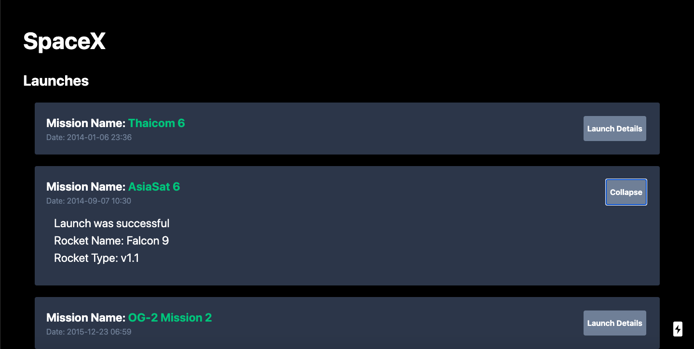

# SpaceX Launch
A simple Next.js app which uses the [SpaceX GraphQL API](https://api.spacex.land/graphql/). Also uses TailwindCSS and Apollo Client.

## Screenshot

## To Run
- Clone into repo
- Run `yarn`
- Run `yarn dev`
- Visit `localhost:3000`

A sample demo is hosted [here](https://spacexlaunchessm.netlify.app/)
